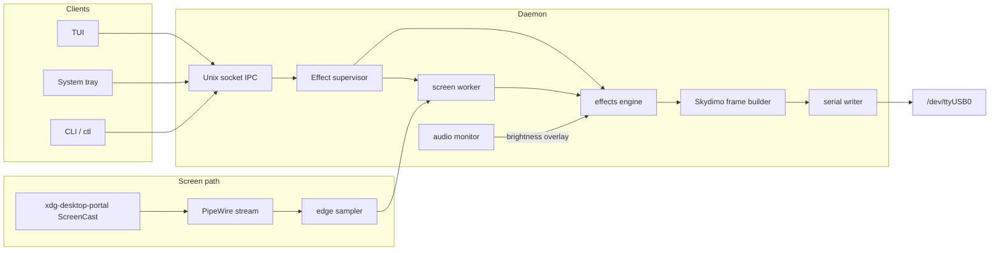

# hyper-sync

Low-latency LED sync for **Skydimo** strips on Linux/Wayland. A single Rust binary drives 65 RGB LEDs over USB serial, mirrors screen edges via **xdg-desktop-portal + PipeWire**, and optionally reacts to system audio — no Node/Bun runtime, no multi-platform baggage.

Built in gated phases (solid → candle → screen sync → systemd) and extended with a background daemon, TUI, tray, animated effects, and sound-reactive brightness.

## Hardware

| Setting | Value |
|---------|-------|
| Controller | Skydimo (CH340 USB-serial, `0x1a86:0x7523`) |
| Device path | `/dev/ttyUSB0` (typical; verify with `dmesg`) |
| Baud rate | **115200** (8N1, no flow control) |
| LED count | **65** — U-shape: 17 right + 31 top + 17 left (no bottom) |
| RGB order | RGB |
| Data input (LED 0) | **Bottom-right** corner (seated view), counter-clockwise |

At 115200 baud a full frame is ~17 ms on the wire, so **~30 fps** is the practical ceiling unless firmware accepts higher baud (unlikely on CH340).

## Architecture



One process owns the serial port. TUI and tray are thin IPC clients; legacy subcommands (`solid`, `screen`, …) patch the running daemon when it is already up.

## Features

### Daemon & control

- Background **daemon** with hot config reload (`inotify` on `~/.config/hyper-sync/config.toml`)
- **Unix socket IPC** — `$XDG_RUNTIME_DIR/hyper-sync.sock`
- **`hyper-sync ctl`** — status (plain/JSON), stop, restart, quit, reselect screen, patch settings
- **Serial reconnect** on USB unplug/replug
- **KDE autostart** desktop entry installed by `./scripts/build.sh`
- Optional **systemd user unit** (`systemd/hyper-sync.service`)

### Effect modes

| Mode | Description |
|------|-------------|
| `off` | All LEDs black |
| `screen` | Screen edge colors (portal + PipeWire) |
| `screen_center` | Screen sync sampled from center-weighted regions |
| `solid` | Uniform color (hex or `rainbow`) |
| `candle` | Warm flicker + slow breathe |
| `chase` | Moving dot around the strip |
| `wave` | Sine wave along the strip |
| `scanner` | Back-and-forth highlight |
| `sparkle` | Random twinkles |
| `pulse` | Global brightness pulse |
| `aurora` | Soft color drift |
| `fire` | Flame-like animation |
| `heartbeat` | Double-pulse rhythm |
| `segment` | Per-segment blocks (right / top / left) |
| `strobe` | Hard on/off flash |
| `wipe` | Color wipe around the strip |
| `sound_viz` | Frequency-band visualization driven by audio |

Shared controls: **brightness**, **speed**, **FPS** (24/30/45/60), **color** presets + rainbow.

### Screen sync

- **XDG Desktop Portal** screencast via `ashpd` (KDE Plasma 6 / `xdg-desktop-portal-kde`)
- **Persisted permission** — restore token saved to `~/.config/hyper-sync/restore-token`
- **PipeWire** stream with edge sampling mapped through `config/layout.toml`
- Survives resolution changes; **`R`** in TUI or `ctl reselect-screen` / `--forget-portal` to re-pick monitor
- NVIDIA offload env vars documented for systemd (`__NV_PRIME_RENDER_OFFLOAD`, `__GLX_VENDOR_LIBRARY_NAME`)

### Audio-reactive overlay

Works on top of any effect (not just `sound_viz`):

| Setting | Description |
|---------|-------------|
| **Sound mode** | `off` · `level` (uniform boost) · `balance` (pan-weighted zones) |
| **Audio boost** | How much bass-driven brightness rises toward full at peaks |
| **Sensitivity** | Input drive, envelope speed, and shaping (tuned for music/games) |

- Captures the **default PipeWire sink monitor** via `parec` (48 kHz stereo F32)
- **Bass-weighted** boost (~100 Hz low-pass) so kicks pump without treble flicker
- Soft-knee dynamics + envelope for a smooth ~30 fps feel on the LEDs
- **`sound_viz`** effect renders a multi-band spectrum on the strip

Requires `parec` (PipeWire) on `PATH`.

### TUI

Interactive panel (`hyper-sync tui`) — **`q`** detaches, daemon keeps running.

**Layout:** status (left) · controls — visual + audio groups (center) · effect list (right)

| Key | Action |
|-----|--------|
| `w` / `s` | Brightness down / up |
| `a` / `d` | Speed down / up |
| `-` / `=` | Cycle FPS preset |
| `↑` / `↓` | Select effect (digits jump) |
| `←` / `→` | Cycle color preset |
| `Tab` | Cycle sound mode |
| `j` / `k` | Audio boost down / up |
| `h` / `l` | Sensitivity down / up |
| `R` | Reselect screen capture |
| `Ctrl+R` | Restart daemon effect |
| `Ctrl+C` | Detach TUI |

FPS and color pickers show the selected preset in `[brackets]`; the legend carries shortcut hints.

### System tray

Right-click: effect submenus (static / ambient / motion / screen), brightness, speed, color, sound, audio boost, sensitivity, FPS, open TUI, quit. Left-click toggles off ↔ last effect. Tooltip shows effect, brightness, and sound/boost when active.

## Requirements

- Linux with **Wayland** (KDE Plasma tested)
- Rust toolchain
- Skydimo controller on USB serial
- For **screen** mode: `pipewire-devel`, `gcc` (bindgen), portal screencast permission
- For **audio**: `parec` (PipeWire)

## Build

```bash
./scripts/build.sh
```

Builds with all features (`screen`, `daemon`, `audio`, `tui`, `tray`) and installs to:

- `~/.cargo/bin/hyper-sync` and `~/.local/bin/hyper-sync`
- Tray icon: `~/.local/share/icons/hyper-sync/hyper-hdr.png`
- KDE autostart: `~/.config/autostart/hyper-sync.desktop`

On Fedora, `scripts/build.sh` sets `BINDGEN_EXTRA_CLANG_ARGS` for system headers.

Minimal build (no screen capture):

```bash
HYPER_SYNC_FEATURES=daemon cargo build --release
```

## Quick start

```bash
# Start daemon (tray icon on KDE)
hyper-sync daemon

# Headless
hyper-sync daemon --no-tray

# Control panel
hyper-sync tui

# CLI status
hyper-sync ctl status
hyper-sync ctl status --json
```

Shared config is created on first start: `~/.config/hyper-sync/config.toml`. Example template: `config/runtime.toml`.

### First-start defaults

| Setting | Default |
|---------|---------|
| Effect | `screen` |
| Brightness | **15%** (0.15) |
| Speed | 1.0× |
| FPS | 30 |
| Solid color | `rainbow` |
| Sound mode | `off` |
| Audio boost | 30% |
| Sensitivity | 30% |

Existing config files are not overwritten — delete or edit `config.toml` to pick up new defaults.

## Configuration

```toml
[device]
port = "/dev/ttyUSB0"
leds = 65

[effect]
mode = "screen"
brightness = 0.15
fps = 30
speed = 1.0

[solid]
color = "rainbow"

[candle]
warmth = 0.9

[screen]
monitor = 0
layout = "config/layout.toml"

[audio]
sound_mode = "off"   # off | level | balance
reactivity = 0.3     # audio boost
sensitivity = 0.3
```

### LED layout

`config/layout.toml` — 65 LEDs, origin **bottom-right**, counter-clockwise:

```
Index 0–16:   right edge, bottom → top
Index 17–47:  top edge, right → left
Index 48–64:  left edge, top → bottom
```

## CLI reference

### Daemon & control

```bash
hyper-sync daemon [--no-tray]
hyper-sync tui
hyper-sync ctl status [--json]
hyper-sync ctl stop | restart | quit | reselect-screen
hyper-sync ctl set --mode screen --brightness 0.2 --fps 30 --speed 1.5 --color ff3300
```

### Direct modes (standalone or IPC patch when daemon runs)

```bash
hyper-sync solid  --port /dev/ttyUSB0 --leds 65 --color ff3300 --brightness 0.15 --fps 30
hyper-sync candle --port /dev/ttyUSB0 --leds 65 --warmth 0.9 --speed 1.0 --fps 30
hyper-sync screen --port /dev/ttyUSB0 --leds 65 --fps 30 --brightness 0.15 --monitor 0
hyper-sync screen --forget-portal          # clear saved screencast permission
hyper-sync off    --port /dev/ttyUSB0 --leds 65
```

### Screen capture permission

First run opens the portal picker — allow persistence when prompted. Revoke in KDE: **Settings → Privacy → Screen Sharing**.

## Protocol

Skydimo frame (not standard Adalight — **no checksum**):

```
[0..2]  'A' 'd' 'a'     (0x41 0x64 0x61)
[3..4]  0x00 0x00
[5]     led_count       (0x41 for 65 LEDs — raw count, not count−1)
[6..]   R,G,B × N       (195 bytes for 65 LEDs)
```

Total: **201 bytes** per frame.

## Systemd

```bash
cp systemd/hyper-sync.service ~/.config/systemd/user/
systemctl --user daemon-reload
systemctl --user enable --now hyper-sync.service
```

The unit sets NVIDIA offload env vars and runs `hyper-sync daemon`.

## Performance notes

| Metric | Target |
|--------|--------|
| Update rate | ~30 fps sustained (serial-limited at 115200) |
| Capture + sample | Low CPU; work stays in capture worker thread |
| Perceived lag | ~20–35 ms (dominated by serial frame time) |
| Robustness | Survives USB replug, config hot-reload, stream resize |

## Phased delivery (original plan)

| Phase | Deliverable | Status |
|-------|-------------|--------|
| 0 | Rust scaffold, Skydimo protocol, serial writer | Done |
| 1 | Solid color + off, 30 Hz loop | Done |
| 2 | Candle effect | Done |
| 3 | Portal + PipeWire screen edge sync, layout remap | Done |
| 4 | Systemd user service | Done |
| + | Daemon, TUI, tray, animated effects, audio overlay | Done |

## License

MIT
